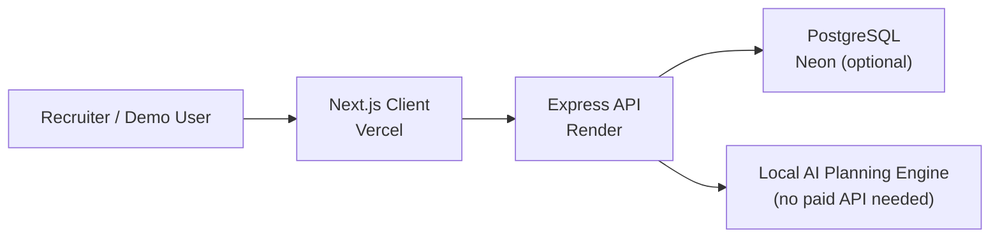

# PlanPilot AI

> AI-powered project delivery dashboard built for recruiter demos, sprint planning, risk visibility, and team execution — no AWS, no paid AI subscription required.

---

## Features

| Feature | Details |
|---------|---------|
| 🤖 **AI Sprint Copilot** | Generates recruiter-ready sprint plans with phase labels, story point estimates, risk scores, and a health summary |
| 📊 **Project Dashboard** | Health score, completion rate, urgent task count, overdue signals, bar chart, pie chart, and execution queue |
| 🗂 **Kanban Board** | Drag-and-drop task management with status columns |
| 📋 **List & Table Views** | Alternative project views for different workflows |
| 📅 **Timeline View** | Gantt-style timeline for delivery visibility |
| 🔍 **Global Search** | Full-text search across tasks, projects, and users |
| 🌙 **Dark Mode** | System-aware dark mode with consistent design tokens |
| 🔒 **Demo Mode** | Runs fully without AWS Cognito — seeded demo data, no setup required |
| 🆓 **Free Deployment** | Designed for Vercel + Render + Neon (all free tier) |

---

## Architecture



**Stack:**
- **Frontend**: Next.js 14, TypeScript, Tailwind CSS, Redux Toolkit Query, MUI Data Grid, Recharts
- **Backend**: Node.js, Express, TypeScript, Prisma ORM
- **Database**: PostgreSQL (Neon) — *optional in demo mode*
- **Auth**: AWS Cognito — *optional, bypassed in demo mode*
- **Testing**: Node built-in test runner + Supertest (backend), Playwright (E2E)

---

## Demo Mode

Demo mode lets recruiters run the full app with zero infrastructure setup:

- Leave **both** Cognito env vars blank in the client — auth is bypassed entirely
- Leave `DATABASE_URL` blank in the server (or set `DEMO_MODE=true`) — the backend uses seeded in-memory data
- The AI Copilot always works regardless of demo mode (it's a local planning engine, not an external API)
- All CRUD operations work in memory during the session

---

## Local Setup

**Requirements:** Node.js ≥ 18

### 1. Install dependencies

```bash
cd client && npm ci
cd ../server && npm ci
```

### 2. Configure the server

```bash
cd server
cp .env.example .env
```

For demo mode (no database), the defaults work as-is. For a real database, set `DATABASE_URL`.

### 3. Configure the client

```bash
cd client
cp .env.example .env.local
```

For demo mode, leave the Cognito values blank. Set `NEXT_PUBLIC_API_BASE_URL=http://localhost:8000`.

### 4. Run locally

```bash
# Terminal 1 — backend
cd server && npm run dev

# Terminal 2 — frontend
cd client && npm run dev
```

Open [http://localhost:3000](http://localhost:3000).

### 5. (Optional) Set up a real database

```bash
cd server
npx prisma generate
npx prisma migrate deploy
npm run seed
```

---

## Deployment Guide

### Frontend → Vercel

1. Connect your GitHub repo on [vercel.com](https://vercel.com)
2. Set root directory to `client`
3. Add environment variables:
   ```env
   NEXT_PUBLIC_API_BASE_URL=https://your-render-api.onrender.com
   NEXT_PUBLIC_COGNITO_USER_POOL_ID=
   NEXT_PUBLIC_COGNITO_USER_POOL_CLIENT_ID=
   ```
4. Deploy — Vercel auto-detects Next.js

### Backend → Render

1. Create a new **Web Service** on [render.com](https://render.com)
2. Set root directory to `server`
3. Build command: `npm install && npm run build`
4. Start command: `node dist/src/index.js`
5. Add environment variables:
   ```env
   PORT=8000
   NODE_ENV=production
   CORS_ORIGIN=https://your-vercel-app.vercel.app
   # Leave DATABASE_URL blank for demo mode, or set a Neon URL for persistence
   DATABASE_URL=
   DEMO_MODE=true
   ```

### Database → Neon (optional)

1. Create a free database on [neon.tech](https://neon.tech)
2. Copy the connection string to `DATABASE_URL` in Render
3. Run migrations via the Render shell: `npx prisma migrate deploy && npm run seed`

---

## Testing

### Backend unit + integration tests

```bash
cd server
npm test
```

Runs 3 test files with 7 tests covering:
- `GET /projects` and `POST /projects`
- `GET /tasks`, `POST /tasks`, and round-trip verification
- `POST /ai/sprint-plan` — happy path, validation, healthSummary, phaseLabel, 400 rejection

### Playwright E2E smoke test

Requires both backend and frontend running locally:

```bash
# Terminal 1
cd server && npm run dev

# Terminal 2
cd client && npm run dev

# Terminal 3
cd client && npm run test:e2e
```

Covers: dashboard load → navigate to Copilot → generate plan → verify health summary → create tasks → open project board.

### Build verification

```bash
cd server && npm run build
cd client && npm run build
```

Both production builds pass cleanly.

---

## Resume Bullets

```
• Built PlanPilot AI, a full-stack AI-powered project management dashboard using
  Next.js 14, Node.js/Express, Prisma ORM, PostgreSQL, Redux Toolkit Query,
  Tailwind CSS, and MUI Data Grid

• Implemented an AI Sprint Copilot (no paid API) that generates sprint plans with
  phase labels, story point estimates, risk scores, and health summaries — converting
  plans into live Kanban board tasks in one click

• Shipped 4 project views (Kanban, List, Table, Gantt timeline), global search,
  dark mode, toast notifications, loading skeletons, and mobile-responsive layout

• Designed a demo mode that bypasses AWS Cognito and PostgreSQL entirely via seeded
  in-memory data — recruiter can open the live demo instantly with zero setup

• Wrote 7 backend integration tests (Node test runner + Supertest) and a Playwright
  E2E smoke test covering the full dashboard-to-copilot task creation flow

• Deployed to Vercel (frontend) + Render (backend) using a free-tier stack with
  optional Neon PostgreSQL; CORS, Helmet, and env-based configuration production-ready
```

---

## Screenshots

> Add your screenshots after deploying:

```
./screenshots/dashboard.png    — Dashboard with analytics and execution queue
./screenshots/copilot.png      — AI Sprint Copilot with health summary and task cards
./screenshots/board.png        — Kanban board with drag-and-drop columns
./screenshots/timeline.png     — Gantt timeline view
```

---

## Portfolio Assets

- **Live demo**: *(add your Vercel URL)*
- **Demo video (60–90 s)**: *(add your Loom or YouTube link)*
- **Architecture diagram**: See Mermaid diagram above

---

## Security Notes

- `npm audit fix` was run for non-breaking updates in both `client` and `server`
- Remaining advisories are in transitive dependencies tied to Next.js and AWS Amplify
- Review `npm audit` output before running `--force` and always test the build after

---

## Known Limitations

| Limitation | Notes |
|-----------|-------|
| In-memory demo data resets on server restart | By design — use PostgreSQL for persistence |
| AI Copilot uses template-based planning, not an LLM | Intentional — keeps it free and demo-safe |
| AWS Cognito auth not wired in demo mode | Remove Amplify dependency if you never plan to use Cognito |
| Playwright tests require local dev servers | Not yet in CI — see testing section |
